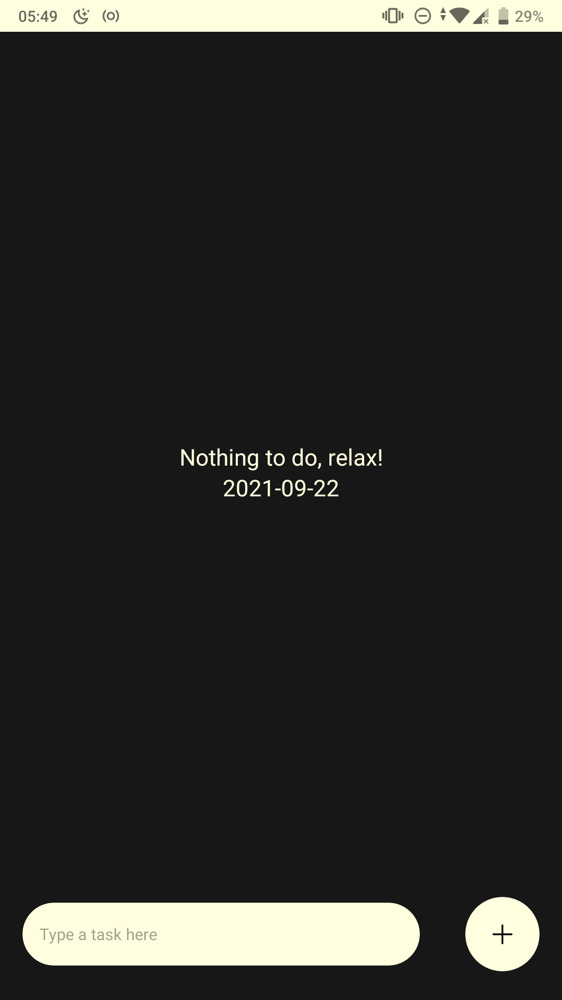
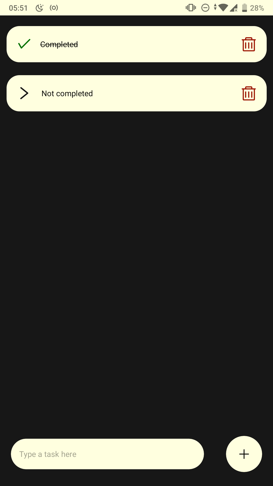

# Simple React Native To-do App

This is a simple to-do app made with react native. This app has the basic to-do app such as display task(s), complete task, and delete task. This app only use the basic element of react native and not using a fancy feature such as `async storage`, that was because this project was intended to familiarise with react native workflow.

## Setup environment

### Desktop

- Make sure you have node installed. For unix-like OS (Linux/Mac OS), you can use `command -v node` from your terminal emulator. If there's no output, please install the node first by download the package from [node website](https://nodejs.org/en/download/) or using your OS package manager (apt, brew, etc).

- Make sure you have expo installed. For unix-like OS (Linux/Mac OS), you can use `command -v expo` from your terminal emulator. If there's no output, you can install expo by using this command in your terminal emulator:
```sh
npm install -g expo-cli
```
> If there's an error please take a look at [npm documentation](https://docs.npmjs.com/resolving-eacces-permissions-errors-when-installing-packages-globally).

- Clone this repo by using your favorite git GUI client or this command in your terminal emulator:
```sh
git clone https://github.com/bruhtus/simple-rn-todo-app.git
```

- After that change directory to the new git repo directory by using this command (assuming you didn't change the directory name or put another argument after the url when using `git clone` command) in your terminal emulator:
```sh
cd simple-rn-todo-app
```

- Please make sure you are in the right directory by using `pwd` command and the output is along this line:
```sh
# like the name implied, optional-directory is optional
# so if you clone the git repo in your home directory, then you can omitted
# the optional-directory
/home/<username>/<optional-directory>/simple-rn-todo-app
```

- After everything clear, install node modules by using this command in your terminal emulator:
```sh
npm install
```

- And then start the app by using this command in your terminal emulator:
```sh
npm start
```
> If those command didn't open the browser automatically, you can use the localhost address like `localhost:19002` in your web browser to access the log interface (there's also a barcode that we will use later). <br>
> Please check the output of the `npm start` for the localhost address.

### Phone

- Install expo app from Google Play Store or App Store with the icon similar to this: <br>

- For android:
  - Open the app (the app is `Expo go` or something along those lines).
  - Select `Scan QR Code`.
  - Point out the camera to the QR code.
- For iOS:
  - Open camera app.
  - Point out the camera to the QR code.
  - Select the notification `Expo QR Code` or something similar.
- Wait until the `Building JavaScript bundle` finished.
- Finally, use the demo (the instructions in the next section).

## Usage

- Type a task in the bottom row element with `Type a task here` on it.
- After you finish typing, you can add the task by using `+` button on the right.
- The task list will appear from the newest to the oldest.
- Delete a task by pressing the `trash can` icon with red color on the right of the task item.
- Complete a task by pressing anywhere in the task item, except the area around the `trash can` icon.
- Undo the completed task by pressing the completed task similar to how complete a task. Think of it like a toggle.

## App Interface

<details>
<summary><strong>Empty task interface</strong></summary>



</details>

<details>
<summary><strong>Completed and not completed interface</strong></summary>



</details>

## References

- [Udemy course: Complete React Native and Redux](https://www.udemy.com/course/the-complete-react-native-and-redux-cours/).
- [Made With Matt youtube tutorial](https://www.youtube.com/playlist?list=PLYBvEAka-q1hJuwRPYQPlEBBRm7_qGw_2).
- [Building a To-Do List with React-Native and Styled-Components](https://dev.to/reenydavidson/building-a-to-do-list-with-react-native-and-styled-components-2148).
- [Stackoverflow comment about completed task](https://stackoverflow.com/q/66427843).
- [Geekforgeeks: how to add key-value pairs dynamically](https://www.geeksforgeeks.org/how-to-create-dictionary-and-add-key-value-pairs-dynamically/).
- [Stackoverflow answer about addding text in new line](https://stackoverflow.com/a/32480141).
- [Check item completed tutorial](https://jeffgukang.github.io/react-native-tutorial/docs/basic-tutorial/basic-features(todolist)/13-complete-items/complete-items.html).
- [Pressable react native documentation](https://reactnative.dev/docs/pressable).
- [FlatList inherits all props from ScrollView](https://stackoverflow.com/a/66594669).
- [ScrollView documentation](https://reactnative.dev/docs/scrollview).
- [Styling with conditional](https://stackoverflow.com/a/45478757).
